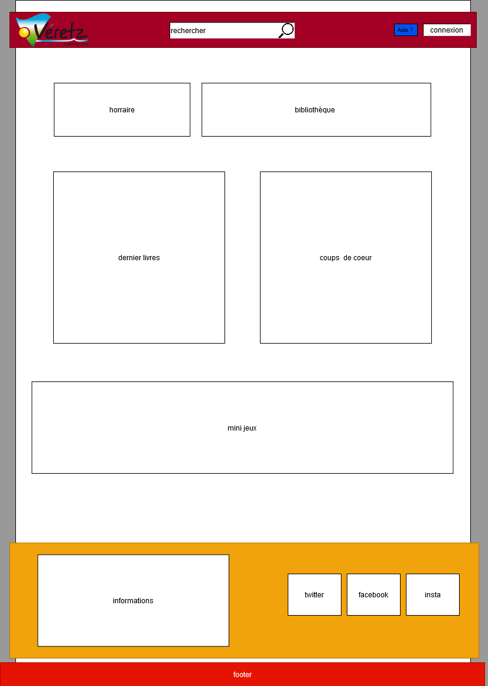
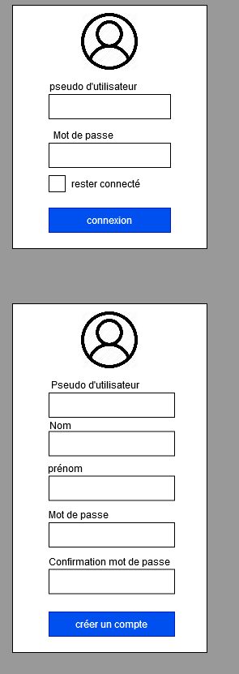
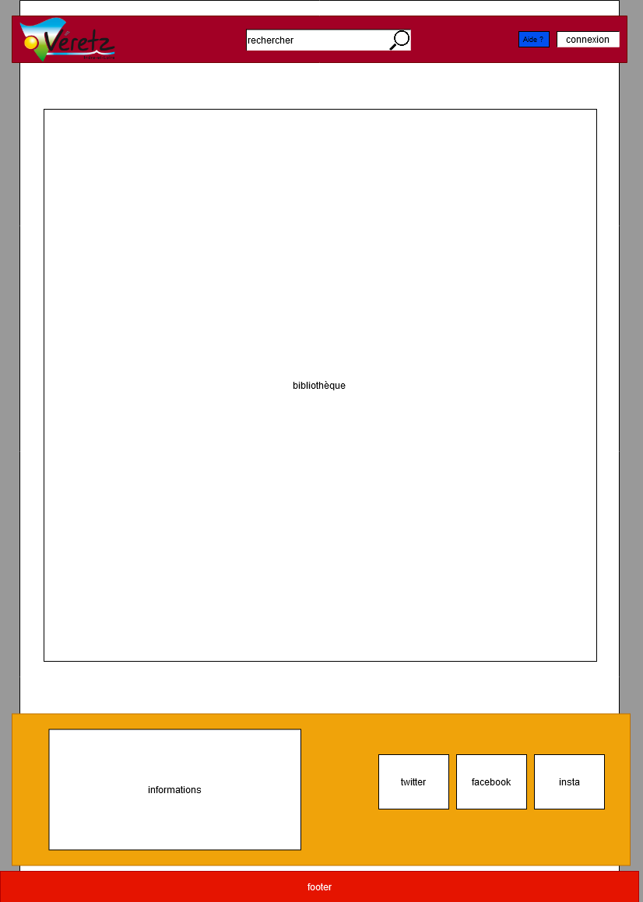
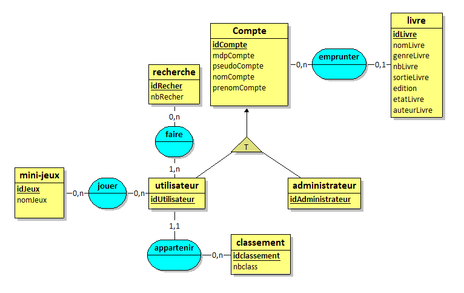

# Cahier des charges : Site web de la bibliothèque de Véretz

### Raphaël PAVARD et Hugo CHAUSSEPIED

## Contexte et présentation du projet


### Contexte 

La bibliothèque de Véretz a besoin d’un site qui permet d’occuper les enfants sur les postes. 

### Objectif 

Créer un site pour que les enfants découvre la littérature et la commune.

### Contraintes fonctionnelles

Un livre a une édition, un état, une date de première édition, un genre et un auteur. 
Un compte peut-être aussi bien un utilisateur qu’un administrateur.

### Contraites techniques

Nous utiliserons l’HTML5, le CSS3 avec Bootstrap pour le visuel.
Pour la liaison à la base de données, nous utiliserons un des serveurs mis en place avec PHP et MySQL. 

### Dates de rendue

#### 12/02/2020 

Cahier des charges avec en plus du contenu habituel attendu : 
MCD/MLD, maquette complète du site et adresse du git.

#### 04/03/2020

Une présentation de notre MVP (produit minimum viable), montrant a minima le fonctionnement 
de notre visuel et de notre connexion. Les jeux et les emprunts seront gérés par la suite.

#### 25/03/2020

Seconde présentation d’un MVP évolué selon les demandes formulées au 04/03/2020 par le chef de projet.

#### 06/05/2020

Rendu final du projet finalisé tel que demandé à la réunion ayant lieu le 08/04/2020.

## Description fonctionnelle des besoins

Ce site devra posséder un système de connexion où il sera possible d'emprunter et de rechercher des 
informations sur les livres de la bibliothèque avec son compte.
Avec ce système de connexion le site possédera un classement des élèves qui empruntent et qui font des 
recherches sur les livres. 
La plate-forme devra posséder deux mini-jeux pour connaître la commune, ses environs ou alors sur la 
littérature jeunesse.

## Propositions

### Aspect visuel du site

#### Accueil



La page d’accueil est découpée en 3 parties 
<details> 
	<summary>La barre de navigation</summary>
        <p>Composée du logo de veretz, d'un bouton aide et du bouton de connexion.</p>
</details>
<details> 
	<summary>Le body</summary>
        <p>Composé d'une interface pour accéder aux horaires, 
		 à la bibliothèque, aux les derniers livres, au mini-jeu.</p>
</details>
<details> 
	<summary>Le footer</summary>
        <p>Composé d'informations avec des coordonnées de la bibliothèque et des liens vers les réseaux sociaux.</p>
</details>

#### Page de connexion



Dans la page de connexion il faut simplement entrer toutes ces infomations pour s'inscrire.

#### Bibliotheque et catalogue



La page de bibliothèque est équivalente à l'accueil mais l’interface 
est la liste des livre de la bibliothèque et c’est aussi la page 
qui sera affiché lorsque l'on fait une recherche.

#### Mini-jeu


La page mini-jeux est équivalente à l'accueil mais l'interface est composée du mini-jeu.

### Méthode merise

#### Modéle Conceptuel de Données



#### Modéle Logique de Données

```
Compte (idCompte, mdpCompte, pseudoCompte, nomCompte, prenomCompte);

classement (idClassement, nbclass);

livre (idLivre, nomLivre, genreLivre, nbLivre , sortieLivre , editionLivre, etatLivre, auteurLivre, #idCompte);

recherche (idRecher, nbRecher);

mini_jeux (idJeux, nomJeux);

utilisateur (idUtilisateur ,#idCompte, #idclassement);

administrateur (idAdministrateur ,#idCompte);

faire (#idRecher, #(#idCompte));

jouer (#idJeux, #(#idCompte));
```


